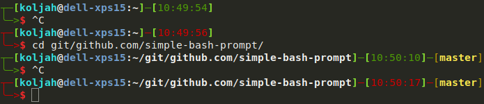

# simple-bash-prompt
A simple colored bash prompt with exit status recognition and git branch detection.

### Installing
Copy *.bash_prompt* to your home directory.

Add  `source ~/.bash_prompt` to your *.bashrc*.

Finished.
